# 📩 AI-Powered SMS Spam Classifier Using NLP and Machine Learning

A simple and effective machine learning app that classifies SMS messages as **Spam** or **Not Spam** using Natural Language Processing (NLP) and the Naive Bayes algorithm. Built with ❤️ using **Streamlit**, **scikit-learn**, and **NLTK**.

---

## 🚀 Live Demo

👉 [Click here to open the app](https://smsspamclassifier-edwnnvw2ovwec7d8vgp9dx.streamlit.app)


---

## 🧠 Features

✅ Predict whether a message is spam or not  
✅ Clean NLP preprocessing pipeline  
✅ Fast and lightweight  
✅ Trained on real-world SMS dataset  
✅ Easy-to-use Streamlit interface  

---

## 📂 Project Files

```
📁 SMS_Spam_Classifier/
│
├── app.py                # Streamlit application
├── SMS_spam_classifier.ipynb  # Notebook for EDA and model training
├── model.pkl             # Trained Naive Bayes model
├── vectorizer.pkl        # Trained TF-IDF vectorizer
├── spam.csv              # Original SMS dataset
├── requirements.txt      # Dependencies
└── .devcontainer/        # VS Code dev container config (optional)
```

---

## 🛠 Installation

### 🔗 Clone the Repository

```bash
git clone https://github.com/your-username/sms_spam_classifier.git
cd sms_spam_classifier
```

### 📦 Install Dependencies

```bash
pip install -r requirements.txt
```

### ▶ Run the App

```bash
streamlit run app.py
```

---

## 📊 Dataset

📁 `spam.csv`  
- Source: [SMS Spam Collection](https://archive.ics.uci.edu/dataset/228/sms+spam+collection)  
- 5,572 SMS messages labeled as **spam** or **ham** (not spam)

---

## 💡 How It Works

1. ✂️ **Preprocessing**: Lowercasing, stopword removal, stemming  
2. 🧠 **Vectorization**: TF-IDF transforms text into numerical features  
3. 🤖 **Model**: Multinomial Naive Bayes trained on processed data  
4. 🌐 **Interface**: Built using Streamlit for real-time predictions  

---

## 🏗️ System Architecture

<div align = "center">
  
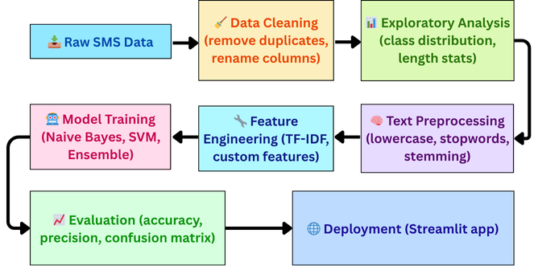

</div>

### 🔁 1. Data Ingestion

- **Source**: `spam.csv`  
- **Encoding**: ISO-8859-1  
- **Initial Shape**: 5,572 rows × 5 columns

---

### 🧹 2. Data Cleaning

- Dropped columns: `Unnamed: 2`, `Unnamed: 3`, `Unnamed: 4`  
- Renamed columns: `v1 → target`, `v2 → text`  
- Encoded labels: `ham → 0`, `spam → 1`  
- Removed 403 duplicates  
- Final shape: 5,169 rows × 2 columns

---

### 🛠️ 3. Feature Engineering

**Derived Features:**

| Feature         | Description                              |
|----------------|------------------------------------------|
| `num_characters` | Character count per message              |
| `num_words`      | Word count per message                   |
| `num_sentences`  | Sentence count (split by `.`)            |

**Text Transformation:**

- Lowercasing  
- Tokenization  
- Stopword Removal  
- Stemming with Porter Stemmer

---

### 📊 4. Exploratory Data Analysis (EDA)

- **Class Balance**:  
  - 87.4% Ham (4,516)  
  - 12.6% Spam (653)  

- **Key Insights**:  
  - Spam messages are ~95% longer  
  - More words per message in spam  
  - Frequent spam keywords: `free`, `call`, `txt`, `claim`, `prize`  
  - Frequent ham keywords: `go`, `get`, `love`, `good`, `like`

- **Visualizations**:  
  - Label distribution pie chart  
  - Word clouds (spam vs ham)  
  - Top 30 words (bar chart)

---

### 🧠 5. Text Vectorization

- **Technique**: TF-IDF  
- **Max Features**: 3,000  
- Converts text into sparse numerical matrix

---

### 🤖 6. Model Training

**Algorithms Tested**:

- GaussianNB, MultinomialNB, BernoulliNB  
- Logistic Regression, SVC, KNN  
- Decision Tree, Random Forest  
- AdaBoost, GradientBoosting, XGBoost  
- BaggingClassifier, ExtraTrees  

**Validation Strategy**: 80/20 split  
**Primary Metric**: **Precision**

---

### 📈 7. Model Evaluation

| Model          | Accuracy | Precision |
|----------------|----------|-----------|
| MultinomialNB  | 97.78%   | **1.00**    |
| RandomForest   | 97.78%   | 0.99      |
| ExtraTrees     | 98.16%   | 0.98      |

---

## 📊 SMS Spam Classifier - Visualizations

<div align="center">

<table>
  <tr>
    <td align="center">
      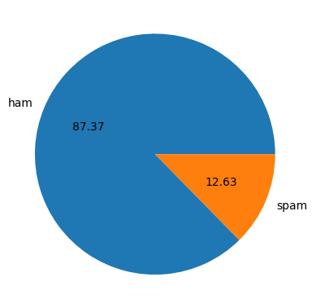<br/>
      <strong>1. Class Distribution</strong>
    </td>
    <td align="center">
      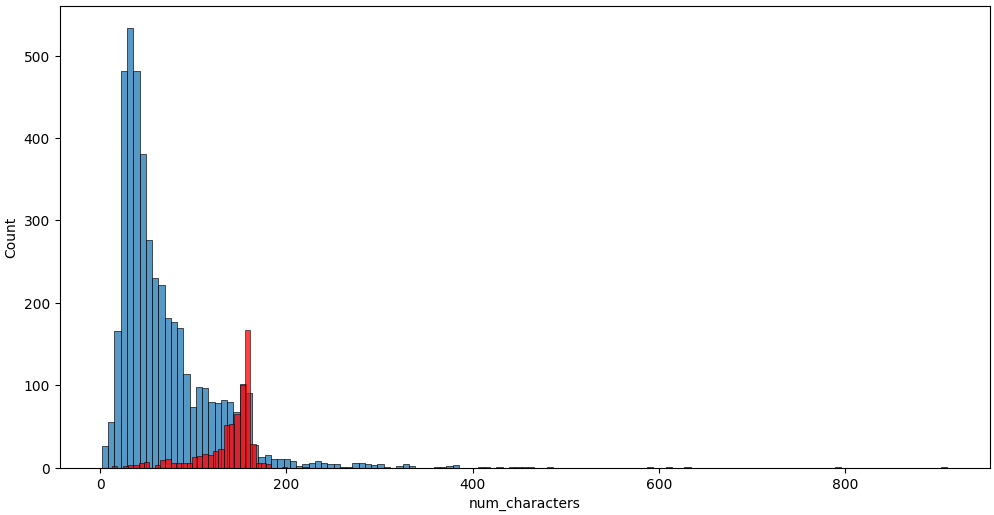<br/>
      <strong>2. Character Count</strong>
    </td>
  </tr>
  <tr>
    <td align="center">
      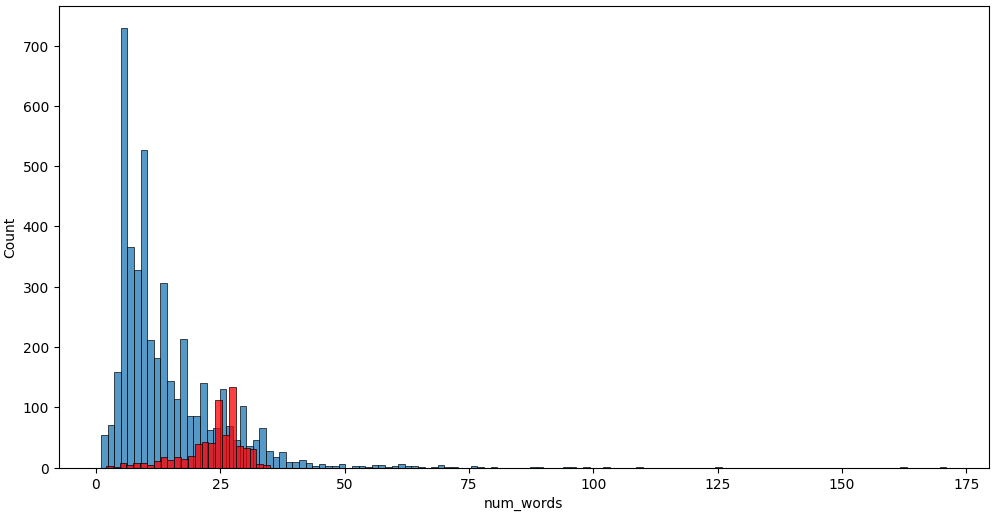<br/>
      <strong>3. Word Count</strong>
    </td>
    <td align="center">
      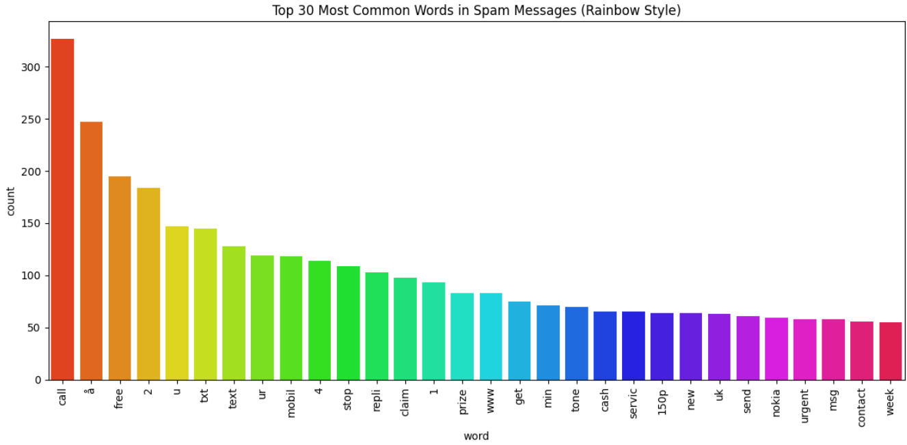<br/>
      <strong>4. Spam Word Frequency</strong>
    </td>
  </tr>
  <tr>
    <td align="center">
      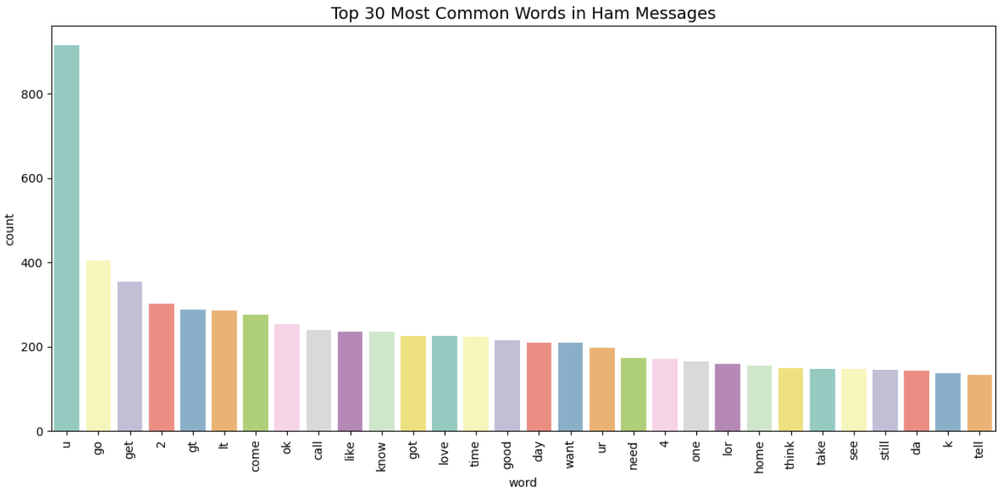<br/>
      <strong>5. Ham Word Frequency</strong>
    </td>
    <td align="center">
      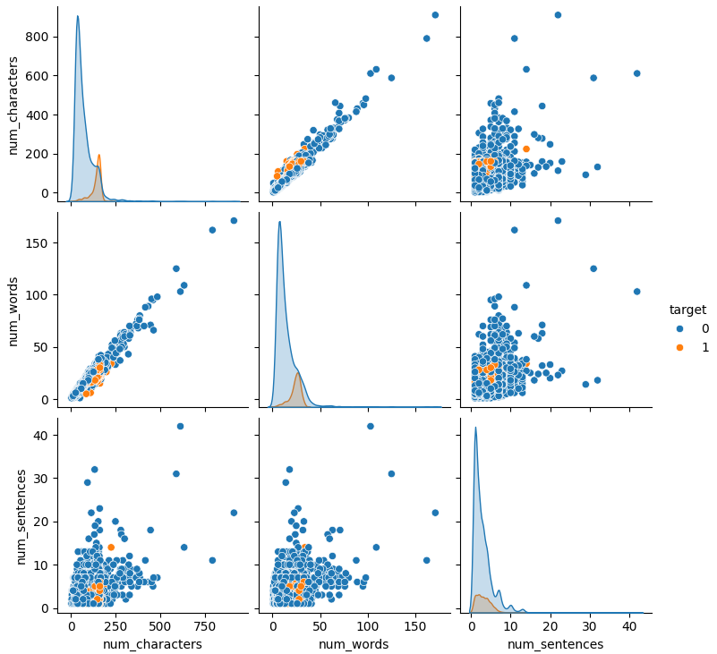<br/>
      <strong>6. Message Length Analysis</strong>
    </td>
  </tr>
  <tr>
    <td align="center">
      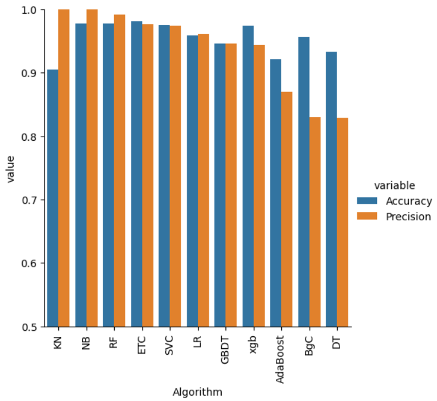<br/>
      <strong>7. Algorithm Comparison</strong>
    </td>
    <td align="center">
      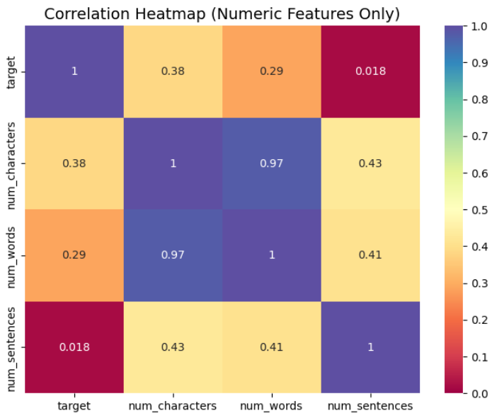<br/>
      <strong>8. Correlation Heatmap</strong>
    </td>
  </tr>
  <tr>
    <td align="center">
      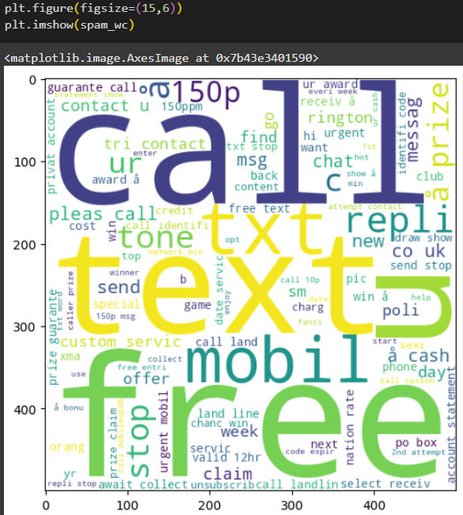<br/>
      <strong>9. Spam Word Count</strong>
    </td>
    <td align="center">
      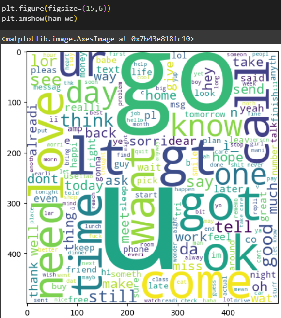<br/>
      <strong>10. Ham Word Count</strong>
    </td>
  </tr>
</table>

</div>


---

### 🤝 8. Ensemble Learning

- **Voting Classifier**: (SVC + MNB + ExtraTrees)  
  - Accuracy: 98.16%  
  - Precision: **99.17%**

- **Stacking Classifier**: (Same base + RF meta)  
  - Accuracy: 98.55%  
  - Precision: 96.95%

---

### 💾 9. Model Persistence

- `model.pkl`: Final MultinomialNB model  
- `vectorizer.pkl`: TF-IDF vectorizer (3,000 features)

---

## 🧾 Component Summary

| Component         | Value                              | Notes                             |
|------------------|------------------------------------|-----------------------------------|
| Dataset Size      | 5,572 → 5,169 rows                 | After removing duplicates         |
| Class Ratio       | 87.4% ham / 12.6% spam             | Slightly imbalanced               |
| Text Pipeline     | Lowercase → Tokenize → Stem        | `transform_text()` function       |
| Vectorizer        | TF-IDF, max_features = 3000        | Custom trained                    |
| Best Base Model   | MultinomialNB                      | Precision = **1.00**              |
| Best Ensemble     | Voting Classifier                  | Precision = 99.17%                |
| Deployment Files  | `model.pkl`, `vectorizer.pkl`      | For Streamlit inference           |

---

## 🔍 Recommendations

| Area                | Suggestion                                           |
|---------------------|------------------------------------------------------|
| Class Imbalance     | Try SMOTE or under-sampling techniques               |
| Hyperparameter Tuning | Tune `max_features`, test n-gram ranges            |
| Embedding Options   | Test BERT, Sentence Transformers                     |
| Thresholding        | Use probability threshold for precision-recall tradeoff |
| Monitoring          | Track input message patterns for concept drift      |
| Safety              | Add fallback for low-confidence predictions         |

---

## 🔍 Examples

**📥 Input (Ham):**  
```
Hey, just checking in. Can we meet tomorrow?
```
**✅ Output:** Not Spam

---

**📥 Input (Spam):**  
```
You've won a free cruise! Click here to claim your prize now.
```
**🚫 Output:** Spam

---

## 🛠 Tech Stack

- 🐍 Python  
- 📊 scikit-learn  
- 🔤 NLTK  
- 🧠 TF-IDF Vectorizer  
- 🌐 Streamlit  

---

## 👤 Author

- **Shreyak Mukherjee**  
  📧 [shreyakmukhrjeedgp@gmail.com](mailto:shreyakmukhrjeedgp@gmail.com)  
  🔗 [LinkedIn](https://www.linkedin.com/in/shreyak-mukherjee-203558275/)  
  💻 [GitHub](https://github.com/shreyakmukherjee)

---

## 📄 License

This project is open-source and available under the [MIT License](LICENSE).

---

⭐ If you like this project, don't forget to give it a star on GitHub!
